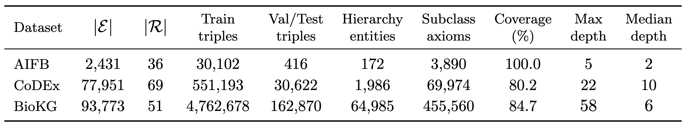
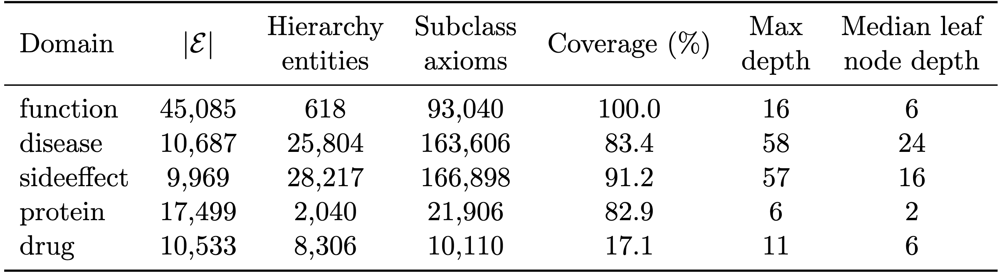

# Dataset Repository for *Hierarchy-Aware Semantic Losses for Knowledge Graph Link Prediction*

This repository contains the datasets and dataset-processing code used in:

> Hierarchy-Aware Semantic Losses for Knowledge Graph Link Prediction.
> *Filip Kronström and Ross D. King.*
> NeSy 2026

[\[Paper link\]](https://openreview.net/pdf?id=mRfGldY4SX) · [\[Paper repository\] ](https://github.com/filipkro/hgnn-lp)

## Overview

This repository contains the datasets used in our work on incorporating class hierarchies and taxonomic information into knowledge graph link prediction. The datasets are based on AIFB [1], CoDEx [2], and BioKG [3].

It includes the processed AIFB dataset, dataset statistics, and scripts for reproducing the dataset construction and preprocessing described in the paper. The CoDEx and BioKG datasets can be downloaded by running the `download.sh` script or manually from our [Zenodo repository](https://doi.org/10.5281/zenodo.22707064).


## Datasets

Overview of the datasets included in the repository.



All datasets are available for download, the code to create the datasets is also provided. To run it, install the dependencies in `requirements.txt`, runs with `Python 3.10.15`.

### AIFB

The dataset for prediction of `publication` links, with separated hierarchy is provided in full in this repository in `datasets/aifb/graphs.pkl`. This is a pickle object with the following content:


| Key | Description |
|---|---|
| `graph` | A `PyG HeteroData` representation of all $\mathcal{A}$—box axioms from AIFB. |
| `train` | The same graph representation as above, but without `publication` links from the validation and test sets. |
| `valid` | The same graph representation as above, but with positive validation `publication` edges in `pos_edge_label_index` and negative in `neg_edge_label_index`.|
| `test` | The same graph representation as above, but with positive test `publication` edges in `pos_edge_label_index` and negative in `neg_edge_label_index`. |
| `gci0` | The class hierarchy represented as an $N\times 2$ tensor where each row contains a `(child, parent)` pair encoded by their `node_id`.|
| `max_id` | Maximum node ID for nodes representing individuals, any higher ID describes a class in the hierarchy.|

Flat triple representations of this information is also provided in `datasets/aifb/train_triples.txt`, `datasets/aifb/val_data.json`, and `datasets/aifb/test_data.json`. Validation and test `.json` files contain positive and negative examples.

Code to produce the files above can be found in `generation_scripts/aifb/aifb_dataset.py` and `generation_scripts/aifb/aifb_flat_files.py`. To run this, first download the AIFB ontology  from [here](https://figshare.com/articles/dataset/AIFB_DataSet/745364?file=1118822) and put the `aifb-fixed_complete.n3` file in the `datafiles/aifb` directory.


### CoDEx
CoDEx, augmented with hierarchy classes from Wikidata can be downloaded from our [Zenodo repository](https://doi.org/10.5281/zenodo.22707064) or by running the download script mentioned above. Similarly to AIFB the dataset is available in the `graphs.pkl` file:

| Key | Description |
|---|---|
| `train` | A `PyG HeteroData` representation of all training triples in CoDEx. |
| `val` | The same graph representation as above, but with positive validation edges in `edge_label_index`.|
| `test` | The same graph representation as above, but with positive test edges in `edge_label_index`. |
| `gci0` | The class hierarchy represented as an $N\times 2$ tensor where each row contains a `(child, parent)` pair encoded by their `node_id`.|
| `max_id` | Maximum node ID for nodes representing individuals, any higher ID describes a class in the hierarchy.|

This data is accompanied by `val_negs.json` and `test_negs.json` containing negative examples for each positive validation and test edge.

Code to produce the files above can be found in `generation_scripts/codex/codex_dataset.py` and `generation_scripts/codex/codex_flat_files.py`. CoDEx triples are provided in `datafiles/codex-l` and hierarchy triples from Wikidata5m [4] can be found in `datafiles/wikidata5m`. If you want to add them yourself you can download CoDEx, e.g., from [here](https://github.com/tsafavi/codex) and Wikidata5m from [here](https://deepgraphlearning.github.io/project/wikidata5m). If you do this, make sure `train.txt`, `valid.txt`, and `test.txt` from CoDEx are added to the `codex-l` directory, along with `full.txt` which contains all triples from the dataset (i.e. the concatenation of the three datasets). For Wikidata5m, create the `full_P31.txt` and `full_P279.txt` files, e.g., by running the following commands on a file, `full.txt` containing all triples from the dataset (again, concatenation of train, val, and test data):
```
cat full.txt | grep P279 >> full_P279.txt
```
and
```
cat full.txt | grep P31 >> full_P31.txt
```
Then make sure these files are placed in `datafiles/wikidata5m`.

### BioKG
BioKG is made up of nodes in five distinct domains, described below:



BioKG, augmented with hierarchy classes, further described below, can be downloaded from our [Zenodo repository](https://doi.org/10.5281/zenodo.22707064) or by running the download script mentioned above. The `graphs.pkl` file contains:

| Key | Description |
|---|---|
| `train` | A `PyG HeteroData` representation of all training triples in BioKG. |
| `val` | The same graph representation as above, but with positive validation `publication` edges in `pos_edge_label_index` and negative in `neg_edge_label_index`.|
| `gci0` | The class hierarchies for the five domains represented as an $N\times 2$ tensor where each row contains a `(child, parent)` pair encoded by their `node_id`.|
| `max_id` | Maximum node ID in each domain for nodes representing individuals, any higher ID describes a class in the hierarchy.|

`test_graph.pkl` contains the test graph as a HeteroData object with with positive test `publication` edges in `pos_edge_label_index` and negative in `neg_edge_label_index`.

To create the datasets yourself, download BioKG, e.g. using the Open Graph Benchmark [5] API:

```Python
from ogb.linkproppred import PygLinkPropPredDataset

PygLinkPropPredDataset(name="ogbl-biokg", root='datafiles/')
```

This will download the BioKG dataset to `datafiles/ogbl_biokg/`. Next you create the hierarchies for the five domains:
### function
The function domain is from the Gene Ontology, but combines terms from a few different releases. We use GO releases from 2015, 2017, 2018, 2020, and 2022, here provided in `datafiles/biokg/go/`. To create the function hierarchy, run the script `generation_scripts/biokg/funtion_gci0.py`.

### protein
The protein hierarchy is constructed from HGNC [6], using the `hgnc_complete_set.txt` (downloaded from [here](https://storage.googleapis.com/public-download-files/hgnc/tsv/tsv/hgnc_complete_set.txt)) and `hierarchy_closure.csv`, `hierarchy.csv`, and `family.csv` found [here](https://www.genenames.org/download/gene-groups/#!/#tocAnchor-1-2). These files are also provided in `datafiles/biokg/hgnc/`. To create the protein hierarchy, run `generation_scripts/biokg/protein_gci0.py`.

### drug
To create the drug hierarchy we first mapped the drugs in the KG, represented by PubChem CIDs, to SMILE strings using the PubChem `CID-SMILES` file which can be downloaded from [here](ftp://ftp.ncbi.nlm.nih.gov/pubchem/Compound/Extras/CID-SMILES.gz) (note, this is a large file). Using the SMILE strings we then queried the ClassyFire API [7] to map it to the ChemOnt ontology. To create the drug hierarchy, run `generation_scripts/biokg/drug_gci0.py` (first the `CID-SMILES` file needs to be downloaded).

### disease
The disease hierarchy was found from UMLSMetathesaurus. To recreate it a, you first need to download the `MRREL.RRF` file from [here](https://www.nlm.nih.gov/research/umls/licensedcontent/umlsknowledgesources.html) ([license](https://www.nlm.nih.gov/research/umls/new_users/online_learning/OVR_005.html) needed). To create the disease hierarchy, run `generation_scripts/biokg/disease_gci0.py`.

### sideeffect
Like disease, the sideeffect hierarchy is constructed from UMLS. Hence, the same license and `MRREL.RRF` file is required for construction. To create the sideeffect hierarchy, run `generation_scripts/biokg/sideeffect_gci0.py`.

To create the actual dataset, run `generation_scripts/biokg/ogb2pyg.py`, to generate `graphs.pkl` and `test_graph.pkl` mentioned above.

## References

<!-- ### AIFB -->
[1] Bloehdorn, S. and Sure, Y. (2007). *Kernel Methods for Mining Instance Data in Ontologies*.
https://doi.org/10.1007/978-3-540-76298-0_5

<!-- ### CoDEx -->
[2] Safavi, T. and Koutra, D. (2020). *CoDEx: A Comprehensive Knowledge Graph Completion Benchmark*.
https://doi.org/10.18653/v1/2020.emnlp-main.669

<!-- ### BioKG -->
[3] Walsh, B., Mohamed, S. K., and Nováček, V. (2020). *BioKG: A Knowledge Graph for Relational Learning on Biological Data*.
https://doi.org/10.1145/3340531.3412776

[4] X. Wang, T. Gao, Z. Zhu, Z. Zhag, Z. Liu, J. Li, J. Tang. *KEPLER: A unified model for knowledge embedding and pre-trained language representation*.
https://doi.org/10.1162/tacl_a_00360

[5] W. Hu, M.Fey, M. Zitnik, Y. Dong, H. Ren, B. Liu, M. Catasta, J. Leskovec. *Open Graph Benchmark: Datasets for Machine Learning on Graphs*.     
https://doi.org/10.48550/arXiv.2005.00687

[6] R. L. Seal, B. Braschi, K. Gray, T. E. M. Jones, S. Tweedie, L. Haim-Vilmovsky, E. A. Bruford. *Genenames.org: the HGNC resources in 2023*. https://doi.org/10.1093/nar/gkac888

[7] Y. Djoumbou Feunang, R. Eisner, C. Knox, L. Chepelev, J. Hastings, G. Owen, E. Fahy, C. Steinbeck, S. Subramanian, E. Bolton, R. Greiner, and D.S. Wishart. *ClassyFire: Automated Chemical Classification With A Comprehensive, Computable Taxonomy*. https://doi.org/10.1186/s13321-016-0174-y

## How to cite
If you used our work or found it useful, make sure to cite both the underlying dataset (AIFB, CoDEx, or BioKG), as well as our [paper](https://openreview.net/pdf?id=mRfGldY4SX):

```
@misc{kronström2026hierarchyawaresemanticlossesknowledge,
      title={Hierarchy-Aware Semantic Losses for Knowledge Graph Link Prediction}, 
      author={Filip Kronström and Ross D. King},
      year={2026},
      eprint={2608.22981},
      archivePrefix={arXiv},
      primaryClass={cs.LG},
      url={https://arxiv.org/abs/2608.22981}, 
}
```